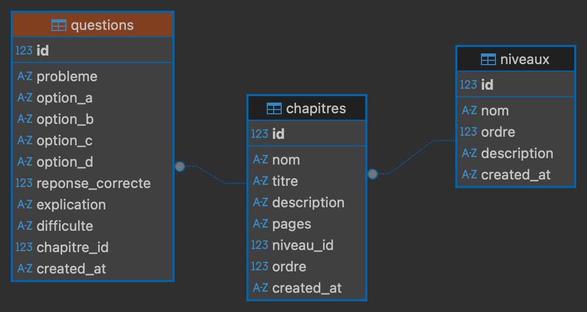
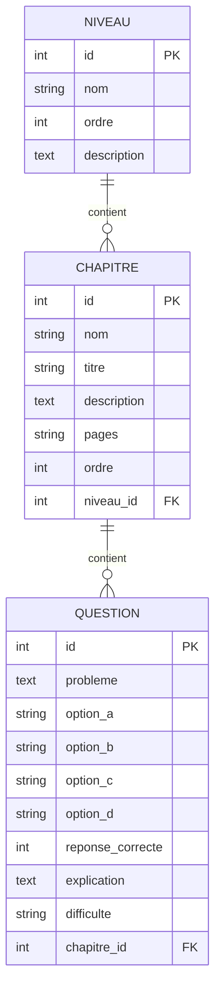

# Site de Tests de Mathématiques - Collège

**MathπSet🎾&Co**

- Démo en ligne : [https://mathsetco.eu.pythonanywhere.com/](https://mathsetco.eu.pythonanywhere.com/)

Une application Flask simple pour proposer des tests de mathématiques en ligne sous forme de QCM pour les niveaux collège (6ème à 3ème).

## Fonctionnalités

- ✅ QCM adaptés par niveau (6ème, 5ème, 4ème, 3ème)
- ✅ Interface moderne et responsive avec Bootstrap
- ✅ Suivi de progression en temps réel
- ✅ Corrections détaillées avec explications
- ✅ Score et feedback personnalisé
- ✅ Navigation clavier (touches 1-4)

## Installation

1. **Activer l'environnement virtuel** (déjà créé) :
   ```bash
   source .venv/bin/activate
   ```

2. **Installer les dépendances** :
   ```bash
   pip install -r requirements.txt
   ```

## Lancement de l'application

1. **Démarrer le serveur Flask** :
   ```bash
   python app.py
   ```

2. **Accéder au site** :
   Ouvrir votre navigateur et aller à : `http://127.0.0.1:5000`

## Configuration .env

Créez un fichier `.env` à la racine du projet avec le contenu suivant :
```
SECRET_KEY=VotreCléSecrète
RESSOURCES_PASSWORD=VotreMotDePasse
DATABASE_URL=sqlite:///qcm_database.db
```
- **SECRET_KEY** : clé secrète Flask
- **RESSOURCES_PASSWORD** : mot de passe pour accéder aux ressources PDF
- **DATABASE_URL** : chemin de la base SQLite

## Accès aux ressources

- Les manuels PDF (6ème, 5ème, 4ème, 3ème) sont accessibles dans la page "Ressources" après authentification.
- Le mot de passe est défini dans le fichier `.env`.

## Administration (route cachée)

- La route `/admin` permet d'accéder à l'interface d'administration (édition, ajout, suppression de QCM et statistiques).
- Cette page n'est pas visible dans le menu principal et nécessite une authentification via le mot de passe des ressources.
- Les principales fonctionnalités :
  - Ajout de nouvelles questions
  - Édition des questions existantes
  - Suppression de questions
  - Consultation des statistiques sur la base de questions

## Structure du projet

```
E-Learning/
├── app.py                 # Application Flask principale
├── requirements.txt       # Dépendances Python
├── templates/            # Templates HTML
│   ├── base.html         # Template de base
│   ├── index.html        # Page d'accueil
│   ├── question.html     # Interface de QCM
│   ├── resultats.html    # Page de résultats
│   ├── chapitres.html    # Sélection des chapitres
│   ├── ressources.html   # Accès aux manuels PDF
│   ├── login_ressources.html # Authentification ressources
│   ├── admin.html        # Interface d'administration QCM
├── models.py              # Modèles SQLAlchemy
├── services.py            # Logique métier QCM
├── database.py            # Gestion base SQLite
├── static/                # Fichiers statiques (PDF, images)
├── instance/              # Dossier d'instance pour la base de données
│   └── qcm_database.db    # Base de données SQLite
└── README.md             # Ce fichier
```

## Utilisation

1. Sur la page d'accueil, choisir un niveau (6ème, 5ème, 4ème ou 3ème)
2. Répondre aux questions du QCM
3. Consulter les résultats et corrections détaillées
4. Possibilité de refaire le test ou changer de niveau
5. Démo publique disponible ici : [https://mathsetco.eu.pythonanywhere.com/](https://mathsetco.eu.pythonanywhere.com/)

## Personnalisation

Pour ajouter de nouvelles questions, modifier le dictionnaire `QUESTIONS` dans `app.py`.

Structure d'une question :
```python
{
    "id": 1,
    "probleme": "Énoncé du problème...",
    "options": ["Réponse A", "Réponse B", "Réponse C", "Réponse D"],
    "reponse_correcte": 0,  # Index de la bonne réponse (0-3)
    "explication": "Explication de la solution..."
}
```

## Sécurité

⚠️ **Important** : Changez la `secret_key` dans `app.py` avant une utilisation en production !

- Ne jamais commiter le fichier `.env`.
- Changez le mot de passe et la clé secrète en production.
- Les accès aux ressources et à l'administration sont protégés.

## Base de données

- SQLite par défaut, migrations possibles via SQLAlchemy.
- Initialisation automatique des données de test si la base est vide.

## Diagramme de la base de données





## Contact

Pour toute question : mathsetco@gmail.com
